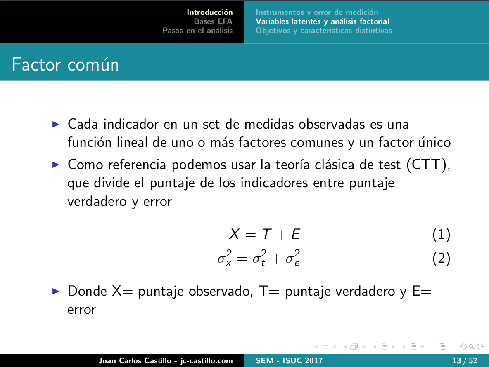
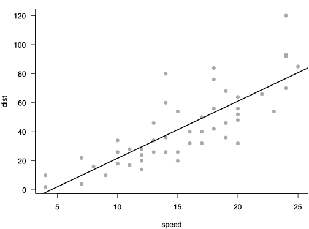
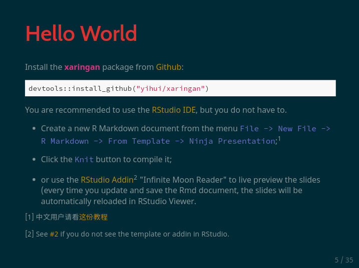

class: front


<!---
Para correr en ATOM
- open terminal, abrir R (simplemente, R y enter)
- rmarkdown::render('static/docpres/07_interacciones/7interacciones.Rmd', 'xaringan::moon_reader')

About macros.js: permite escalar las imágenes como [scale 50%](path to image), hay si que grabar ese archivo js en el directorio.
--->


.pull-left[
# Ciencia Social Abierta
## cienciasocialabierta.netlify.app
----
## Juan Carlos Castillo
## Sociología FACSO - UChile
## 1er Sem 2020
]


.pull-right[
.right[

]

## Sesión 12: *Presentaciones en texto plano con Xaringan*
]

---

layout: true
class: animated, fadeIn

---
class: inverse middle center


# ¿Presentaciones en texto plano?


???

Referencia inicial a la importancia de las presentaciones como dispositivo comunicacional en la vida académica y profesional

---

- **Modelo "Office"** (monopolio comercial, no un estándar de calidad) posee su versión de presentaciones: Power Point

- Ventajas: simpleza, flujo cortar/pegar

- Desventaja para presentación de resultados de investigación: 

  - Baja reproducibilidad
  - Inclusión de código / resultados
  - Accesibilidad: destinado a ser "adjunto" a un correo, y luego requiere apertura local
  
---
# Presentaciones en texto plano

.pull-left[
.medium[
- representante icónico: Beamer (Latex)

- buen control de output

- excelente para presentación de resultados de investigación

- problema: los de Latex, muchas marcas de edición y muy sensible a los errores.
]]

.pull-right[


]
---
# Presentaciones texto plano: (R)Markdown


Varias alternativas:

- ioslides

- slidy

- reveal

- [remark](https://remarkjs.com/)

---
class: middle

.pull-left[

]

.pull-right[
- Librería R basada en remark

- Genera presentaciones en html

- Junta las funcionalidades de RMarkdown y las capacidades de remark

- ... otra de Yihui Xie
]


---
class: roja middle right

# 1. Bases


---
# Lógica de funcionamiento


- Archivo RMarkdown se compila con Xaringan

- Genera un md que luego es transformado por remark en html

- (no pasa por pandoc)

- remark funciona en línea


---
# Repositorio

.center[

[https://github.com/yihui/xaringan](https://github.com/yihui/xaringan)
]
---
# Instalación


```
install.packages("xaringan")
```

--

- Generar archivo desde plantilla (opcional) desde RStudio

  - `File -> New File -> R Markdown -> From Template -> Ninja Presentation`

--

- Botón `Knit` para renderizar

---
# Bases:  YAML


```r
---
title: "Presentación"
subtitle: "Muy interesante"
author: "Yihui Xie"
output:
    xaringan::moon_reader:
    lib_dir: libs
    nature:
      highlightStyle: github
      highlightLines: true
      countIncrementalSlides: false
---
```

---
# Bases:  YAML

.pull-left[

.small[

```r
---
title: "Presentación"
subtitle: "Muy interesante"
author: "Yihui Xie"
output:
*   xaringan::moon_reader:
    lib_dir: libs
    nature:
      highlightStyle: github
      highlightLines: true
      countIncrementalSlides: false
---
```
]
]

.pull-right[

- indica que la renderización del documento RMarkdown se realiza vía presentación Xaringan


]


---
# Bases:  YAML

.pull-left[

.small[

```r
---
title: "Presentación"
subtitle: "Muy interesante"
author: "Yihui Xie"
output:
    xaringan::moon_reader:
*   lib_dir: libs
    nature:
      highlightStyle: github
      highlightLines: true
      countIncrementalSlides: false
---
```
]
]

.pull-right[

- especifica el nombre de la carpeta donde se guardan los archivos/códigos que permiten generar la presentación 


]

---
# Bases:  YAML

.pull-left[

.small[

```r
---
title: "Presentación"
subtitle: "Muy interesante"
author: "Yihui Xie"
output:
    xaringan::moon_reader:
    lib_dir: libs
    nature:
*     highlightStyle: github
      highlightLines: true
      countIncrementalSlides: false
---
```
]
]

.pull-right[

- Estética de los bloques de código

- Alternativas en [http://animation.r-forge.r-project.org/knitr/](http://animation.r-forge.r-project.org/knitr/)


]


---
# Bases:  YAML

.pull-left[

.small[

```r
---
title: "Presentación"
subtitle: "Muy interesante"
author: "Yihui Xie"
output:
    xaringan::moon_reader:
    lib_dir: libs
    nature:
      highlightStyle: github
*     highlightLines: true
      countIncrementalSlides: false
---
```
]
]

.pull-right[

- Para destacar líneas de código (tal como aparece en celeste a la derecha)

- Opera agregando un * al comienzo de la línea de código

]

---
# Bases:  YAML

.pull-left[

.small[

```r
---
title: "Presentación"
subtitle: "Muy interesante"
author: "Yihui Xie"
output:
    xaringan::moon_reader:
    lib_dir: libs
    nature:
      highlightStyle: github
      highlightLines: true
*     countIncrementalSlides: false
---
```
]
]

.pull-right[

- Para que no se cuenten como slides adicionales aquellas donde hay transiciones dentro de la slide (más adelante)


]

---
# Otras opciones YAML:

- `ratio`: dimensiones de la slide (por ejemplo, esta es ratio:'16:9')

- `css`: ruta a archivo css con opciones específicas de formato (más adelante)

- `seal:FALSE`: para omitir la slide de título automático

Más detalles en [capítulo de Xaringan de libro RMarkdown](https://bookdown.org/yihui/rmarkdown/xaringan.html) 


---
# Bases:  Separadores

.medium[

- Para crear nueva slide: tres guiones

`---`

(Tiene que estar pegada a la izquierda, y sin espacios después)

]

--
.medium[
- Para secuencias incrementales dentro de una slide: dos guiones

`--`

- Para notas de la slide: ??? (se ven en modo presentación con 2 monitores)

]

---
# Opciones presentación

- Presionar "h" en documento html para shorcuts

- Básicos:
  - f: pantalla completa
  - c: clonar
  - p: modo presentador
  
---
# Columnas:

.pull-left[


`````
.pull-left[

Aquí va la columna 
izquierda

]

`````

]


.pull-right[


`````
.pull-right[

Aquí va la columna 
derecha

]

`````

]


---
# Formato

- esta mísma lógica de formato `.tag[]` se aplica a:

  - `.center[]`
  - `.left[]`
  - `.right[]`
  - `.small[]`

- se pueden adaptar / crear nuevas en archivo .css (más adelante)

---
# Clases:

- opción `class`: señala características generales de la slide

 - inverse: fondo negro, letras blancas
 
 - middle - top - bottom
 
 - left - right

---
# Clases:

.pull-left[
.small[ 
 

```r
---
class: inverse middle right 

# Aquí un título

## Aquí un subtítulo
```
 ]
]

.pull-right[

]


---
# Ecuaciones vía mathjax 


```
$$\bar{X}=\frac{1}{n}\sum_{i=1}^nX_i$$
```

Resulta en:


$$\bar{X}=\frac{1}{n}\sum_{i=1}^nX_i$$

---
# R Plots
.pull-left[
.small[

```r
fit = lm(dist ~ 1 + speed, data = cars)
par(mar = c(4, 4, 1, .1))
plot(cars, pch = 19, col = 'darkgray', las = 1)
abline(fit, lwd = 2)
```
]]

.pull-right[

<!-- -->
]


---
# Tablas (html)

.medium[

```r
knitr::kable(head(iris), format = 'html')
```

<table>
 <thead>
  <tr>
   <th style="text-align:right;"> Sepal.Length </th>
   <th style="text-align:right;"> Sepal.Width </th>
   <th style="text-align:right;"> Petal.Length </th>
   <th style="text-align:right;"> Petal.Width </th>
   <th style="text-align:left;"> Species </th>
  </tr>
 </thead>
<tbody>
  <tr>
   <td style="text-align:right;"> 5.1 </td>
   <td style="text-align:right;"> 3.5 </td>
   <td style="text-align:right;"> 1.4 </td>
   <td style="text-align:right;"> 0.2 </td>
   <td style="text-align:left;"> setosa </td>
  </tr>
  <tr>
   <td style="text-align:right;"> 4.9 </td>
   <td style="text-align:right;"> 3.0 </td>
   <td style="text-align:right;"> 1.4 </td>
   <td style="text-align:right;"> 0.2 </td>
   <td style="text-align:left;"> setosa </td>
  </tr>
  <tr>
   <td style="text-align:right;"> 4.7 </td>
   <td style="text-align:right;"> 3.2 </td>
   <td style="text-align:right;"> 1.3 </td>
   <td style="text-align:right;"> 0.2 </td>
   <td style="text-align:left;"> setosa </td>
  </tr>
  <tr>
   <td style="text-align:right;"> 4.6 </td>
   <td style="text-align:right;"> 3.1 </td>
   <td style="text-align:right;"> 1.5 </td>
   <td style="text-align:right;"> 0.2 </td>
   <td style="text-align:left;"> setosa </td>
  </tr>
  <tr>
   <td style="text-align:right;"> 5.0 </td>
   <td style="text-align:right;"> 3.6 </td>
   <td style="text-align:right;"> 1.4 </td>
   <td style="text-align:right;"> 0.2 </td>
   <td style="text-align:left;"> setosa </td>
  </tr>
  <tr>
   <td style="text-align:right;"> 5.4 </td>
   <td style="text-align:right;"> 3.9 </td>
   <td style="text-align:right;"> 1.7 </td>
   <td style="text-align:right;"> 0.4 </td>
   <td style="text-align:left;"> setosa </td>
  </tr>
</tbody>
</table>
]


---
class: roja middle right

# 2. Extensiones

---
# Infinite moon-reader

- add-in RStudio

- al seleccionarlo, se actualiza permanentemente al momento de modificar.

- actualización de cambios de estructura (ej: agregar slide) se actualizan simplemente grabando el documento .Rmd 


---
# Xaringan themer


.small[ [https://github.com/gadenbuie/xaringanthemer](https://github.com/gadenbuie/xaringanthemer)  ]

---
# Xaringan themer


```r
install.packages("xaringanthemer")
```

YAML: agregar línea


```r
output:
  xaringan::moon_reader:
    css: xaringan-themer.css
```


---
# Xaringan themer

Agregar chunk al inicio:


````
```{r xaringan-themer, include=FALSE, warning=FALSE}
library(xaringanthemer)
aqui_el_estilo(aquí_las_opciones)
```
````

Detalles de los estilos y opciones:

[https://pkg.garrickadenbuie.com/xaringanthemer/index.html](https://pkg.garrickadenbuie.com/xaringanthemer/index.html)

---

.medium[
````
```{r xaringan-themer, include=FALSE, warning=FALSE}
library(xaringanthemer)
style_solarized_dark()
```
````
]
.center[

]


---
# Xaringan extra

- Ofrece varias opciones como:

 - animaciones
 
 - visión general de las slides
 
 - agregar logo a slides
 
 - agregar webcam
 
[https://github.com/gadenbuie/xaringanExtra](https://github.com/gadenbuie/xaringanExtra) 
 
---
# Xaringan extra

- instalar:


```r
devtools::install_github("gadenbuie/xaringanExtra")
```

- agregar chunk con opciones a utilizar, ej:

.medium[
````
```{r xaringanExtra, echo=FALSE}
xaringanExtra::use_xaringan_extra(c("tile_view", "animate_css"))
```
````

- Ej: presionar "o" para tile view


]


---
class: animated slideInRight fadeOutLeft

# Xaringan extra
## animate_css


```r
---
class: animated slideInRight fadeOutLeft

## esta slide...

- viene desde la derecha 
- y se difumina a la izquierda en la salida
```


---
# Xaringan extra
## animate_css

- Para animar todas las slides con un mismo efecto, al principio:


```r
---

layout: true
class: animated, fadeIn

---
```

---

# Imágenes

- Para regular tamaño: agregar macro en YAML (bajo `nature`)


```r
beforeInit: "https://multinivel.netlify.com/docpres/xaringan_custom/macros.js"
```


- Esto permite ajustar el tamaño de las imágenes de la siguiente manera:


```r

```

 


---
class: front


.pull-left[
# Ciencia Social Abierta
## cienciasocialabierta.netlify.com
----
## Juan Carlos Castillo
## Sociología FACSO - UChile
## 1er Sem 2020
]


.pull-right[
.right[

]


]
